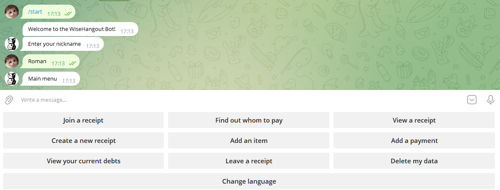
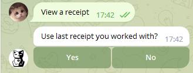
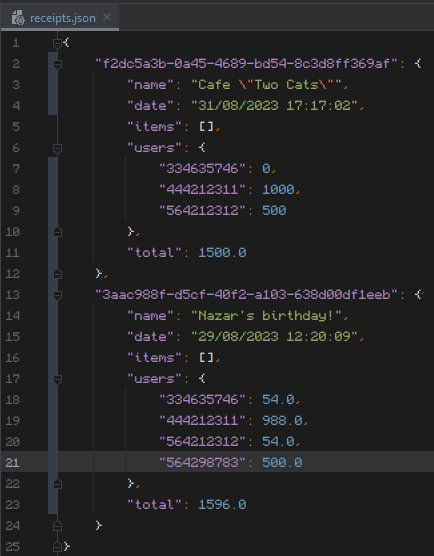
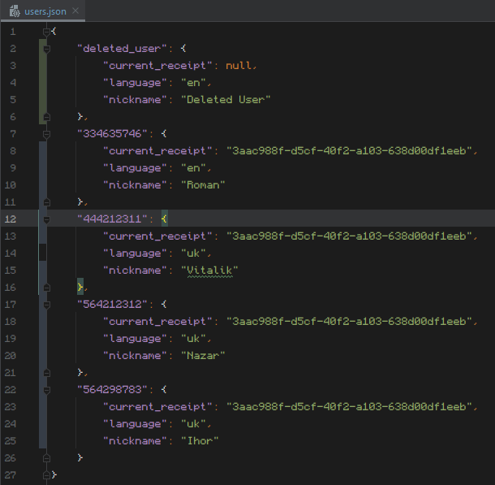

# wise-hangout-bot
Welcome to Wise Hangout Bot, your personal assistant for group hangout!

This is my personal project for my internship at UpLab.


## Features
- Keeps track of your hangout total expenses.
- Will tell you who you can pay to even out the expenses.
- Localization support (English, Ukrainian) with custom language if implemented.
- Easy to use and intuitive interface.
- Possibility to natively delete your data from the database.
- Logs all the actions in the log file.

### How to use (executable)
1. Download repository and open `build.bat` (*Windows*) or `build.sh` (*macOS*) to build the project.
2. Open `.env` file and fill in the required information. (OWNER_ID is optional on first run)
3. Run `launch.exe` to start the bot.

### How to use (IDE)
1. Download repository and open `main.py` in your IDE.
2. Open `.env` file and fill in the required information. (OWNER_ID is optional on first run)
3. Run `main.py` to start the bot.

Ideally, you .env file should look like this:
```dotenv 
TOKEN="GFGGGFSD2344$ffdsFFFGGKK#442333"
OWNER_ID="54324232"
```

## Screenshots
<p align="center">
  
</p>

<p align="center">
  
</p>

<p align="center">
  
</p>

<p align="center">
  
</p>

If you find any bugs, feel free to report them in the issues section. I will try to fix them as soon as possible, although I can't guarantee anything.

<p align="center">
  
</p>