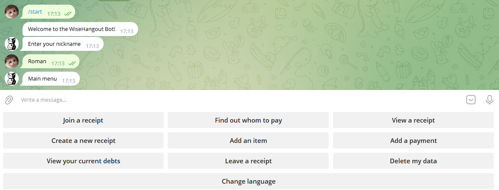
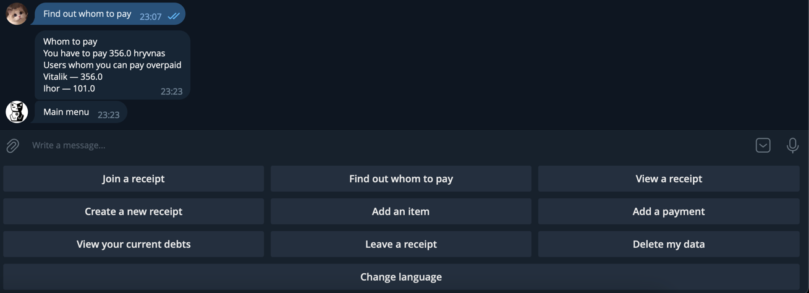
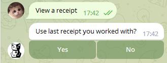
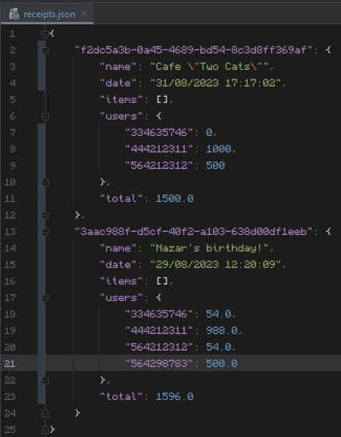
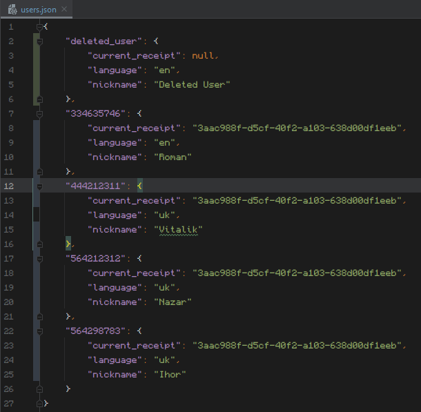

# wise-hangout-bot
Welcome to Wise Hangout Bot, your personal assistant for group hangouts!

This is my personal project for my internship at UpLab.


## Features
- Keeps track of your hangout total expenses.
- Tells user you who they can pay to even out the expenses.
- Localization support (*English and Ukrainian*, with custom language if implemented).
- Easy to use and intuitive interface.
- Possibility to natively delete user data from the database.
- Logs all the actions in the log file.

## How to use (executable)
1. Download `Python 3.11` from official website and install it. Make sure to check `Add to PATH` option during installation.
2. Download repository and build it using `build.*` files. IF you are on *Windows*, then just open `build.bat`. If you are on *macOS*, launch `build.sh` from terminal.
3. Open `.env` file and fill in the required information. (OWNER_ID is optional on first run)
4. If you are on *Windows*, simply run `launch.exe` to start the bot. If you are on *macOS*, run `launch` from terminal.

## How to use (IDE)
1. Download `Python 3.11` from official website and install it. Make sure to check `Add to PATH` option during installation.
2. Download repository and open it in your IDE.
3. Open `.env` file and fill in the required information. (OWNER_ID is optional on first run, before you get your ID from the bot)
4. Run `main.py` to start the bot.

## Environment variables
Ideally, you .env file should look like this:
```dotenv 
TOKEN="GYffISGbSD2344OfdsFFFGGKK4IIOF2633"
OWNER_ID="54324232"
```

## Screenshots
<p align="center">
  
</p>

<p align="center">
  
</p>

<p align="center">
  
</p>

### Database files

<p align="center">
  
</p>

<p align="center">
  
</p>

## Afterword

If you find any bugs, feel free to report them in the issues section. I will try to fix them as soon as possible, although I can't guarantee anything.
And thank you for using my bot! Don't forget to star the repository if you liked it! Or **IT** will come for you. See ya!
<p align="center">
  
</p>